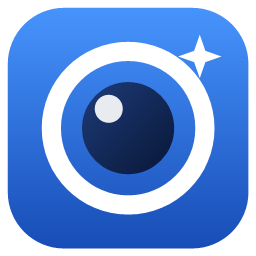
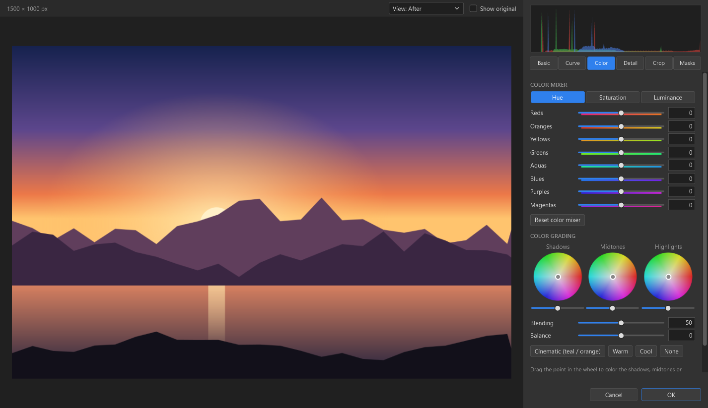
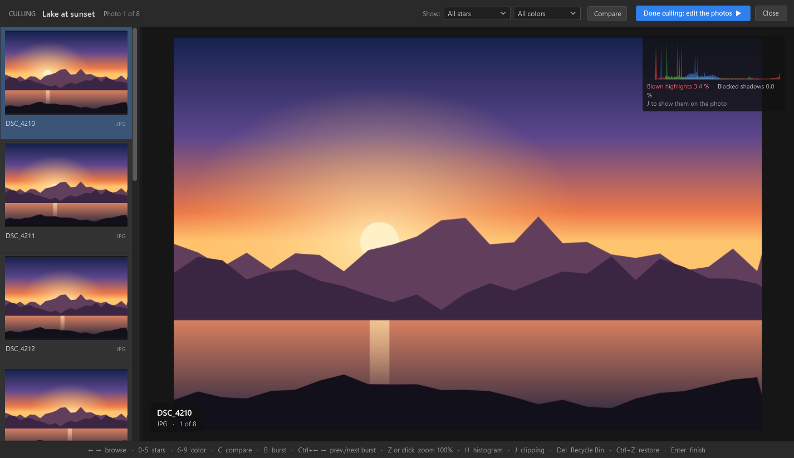
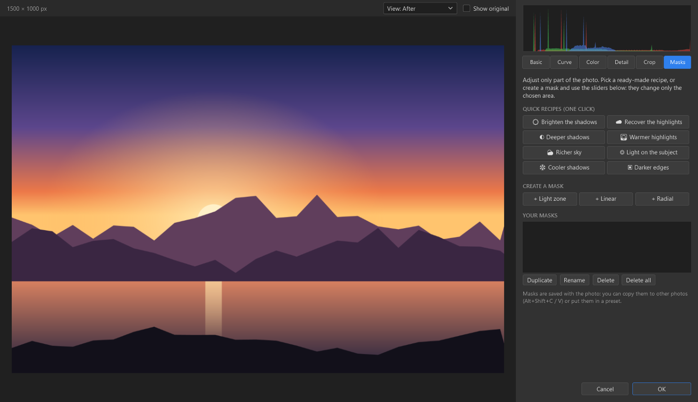
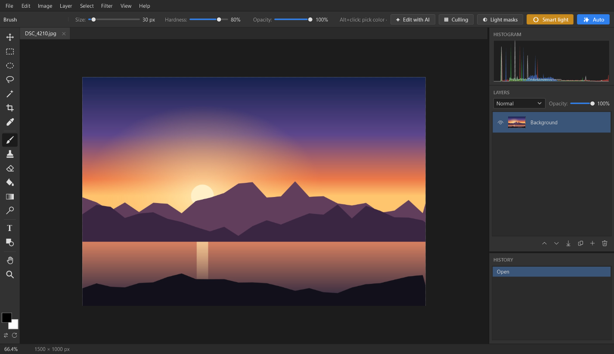

<div align="center">



# PhotoStudio

**A free, open-source photo editor for Windows.**<br>
Sort a whole shoot, develop your RAW files and retouch them, with optional AI help.

[](../../releases/latest)

[](LICENSE)


**English** · [Italiano](README.it.md) · [Deutsch](README.de.md) · [Français](README.fr.md) · [Español](README.es.md)

</div>

<p align="center">
  
</p>

<p align="center">
  <a href="#features">Features</a> ·
  <a href="#installation">Installation</a> ·
  <a href="#is-it-safe-verify-your-download">Is it safe?</a> ·
  <a href="#privacy">Privacy</a> ·
  <a href="#setting-up-the-ai">AI setup</a> ·
  <a href="#for-developers">For developers</a>
</p>

## Features

### 🗂️ Culling

- Open a whole folder or just a few photos, and choose which formats to show (for example, only RAW files).
- Star ratings and color labels, with filters to show only the photos you want.
- Bursts are grouped automatically, so you can pick the best shot quickly.
- Compare photos side by side with synchronized zoom.
- An automatic check flags blurred shots and people with their eyes closed, and picks the best shot of each burst.
- Shooting data (camera, lens, ISO, shutter speed, aperture) and a histogram with clipping warnings.
- Your work is saved: reopen the folder and carry on where you left off.

### 🎞️ RAW development

- Opens more than 25 camera RAW formats (CR2, CR3, NEF, ARW, DNG, RAF, ORF, RW2 and more), as well as JPEG, PNG, TIFF, WebP and HEIC.
- White balance, exposure, contrast, highlights, shadows, whites, blacks, texture, clarity, dehaze, vibrance and saturation.
- Tone curve (RGB and per channel), HSL color mixer and color grading wheels.
- Sharpening, noise reduction, vignette, grain, crop and straighten.
- Local masks (linear, radial and by brightness), a before/after view, presets, and copy/paste of settings.
- **AI subject masks**: the mask follows the outline of the person, animal or object, found by a network on your PC.
- **AI noise reduction** and **AI refocus** (on the subject or on the whole photo), with neural networks that run on your PC, on the graphics card when possible. The networks (about 70 and 115 MB) are downloaded from this project's releases the first time you use them.

### ☀️ Smart light, made easy

- **Smart light**: one click fixes the exposure, then adds light masks only where the photo needs them (dark areas, bright areas, sky, faces or subject). It finds the sky and the faces in the photo (on your PC, nothing is uploaded), keeps night shots dark, and can give a whole series of shots the same correction.
- **Easy light masks**: a simplified panel for beginners, with ready-made recipes and no technical sliders.

### ✨ AI-assisted editing (optional)

- Describe what you want ("warmer, like a sunset") or let the AI choose the best edit.
- Works with **Google Gemini** (free key), **Anthropic Claude** or **Ollama** (completely offline, on your PC).
- The AI only picks slider values. PhotoStudio renders the pixels itself, so every edit stays visible and editable.

### 🖌️ Photo editor and batch work

- Layers, selections, brush, adjustments (levels, curves, hue/saturation, black and white…) and filters (blur, sharpen, noise, vignette…).
- `.psx` project format, which keeps your layers.
- **AI enlargement 2×** (Image menu), which rebuilds the detail instead of just stretching the pixels.
- Apply settings or presets to many photos at once.
- Export with resizing, automatic renaming and a watermark.

### 🌍 In your language

The interface is available in English, Italian, German, French and Spanish. PhotoStudio follows the Windows language, and you can change it in **View ▸ Language**.

<table>
  <tr>
    <td width="50%" valign="top">
      <br>
      <sub><b>Culling</b>: browse a shoot, rate it and delete the rejects.</sub>
    </td>
    <td width="50%" valign="top">
      <br>
      <sub><b>Easy light masks</b>: one-click recipes for sky, shadows and subject.</sub>
    </td>
  </tr>
  <tr>
    <td colspan="2" valign="top">
      <br>
      <sub><b>Editor</b>: layers, tools, history and histogram.</sub>
    </td>
  </tr>
</table>

## Installation

1. Open the [**latest release**](../../releases/latest).
2. Download one of the two files:
   - **`PhotoStudio-x.y.z-win-x64-setup.exe`**: the installer (recommended);
   - **`PhotoStudio-x.y.z-win-x64-portable.zip`**: no installation, just unzip it and run `PhotoStudio.exe`.
3. Run it. You only need Windows 10 or 11 (64-bit): .NET is already included.

The installer does not need administrator rights, and you can remove the program from **Settings ▸ Apps**.

> [!IMPORTANT]
> **"Windows protected your PC"?** Windows shows this message for new programs that are not yet widely downloaded or signed with a paid certificate. Click **More info**, then **Run anyway**. If you want to be sure first, verify the file as described below.

## Is it safe? Verify your download

- **Everything is open source**: you can read every line of code in this repository.
- **Built by GitHub, not on a personal PC**: each release is compiled by [GitHub Actions](.github/workflows/release.yml) directly from the public code. The link to the build log is in the release notes.
- **Checksum**: in PowerShell, the result of this command must match the line in `SHA256SUMS.txt` of the same release:

  ```powershell
  Get-FileHash .\PhotoStudio-x.y.z-win-x64-setup.exe
  ```

- **Signed build provenance**: with the [GitHub CLI](https://cli.github.com/) you can check that the file was built by this repository (replace `OWNER/REPO` with the address of this repository):

  ```powershell
  gh attestation verify .\PhotoStudio-x.y.z-win-x64-setup.exe --repo OWNER/REPO
  ```

## Privacy

- No accounts, no ads and no telemetry. PhotoStudio works offline.
- Your photos never leave your PC, **unless you use the AI features**. In that case PhotoStudio sends only a small preview (at most 1024 pixels on the long side), the slider values, the camera model and shooting settings, and a few brightness statistics. It sends no file names and no GPS position, and only to the service you chose. With Ollama, everything stays on your computer.
- Once a day PhotoStudio asks GitHub whether there is a new version (**Help ▸ Check for updates**). Nothing about you or your photos is sent. When a version is available it asks before installing it, and checks the download against the release's `SHA256SUMS.txt`.
- API keys are encrypted by Windows (DPAPI) and saved only in `%APPDATA%\PhotoStudio`, readable only by your Windows account.

## Setting up the AI

Open **Edit ▸ AI Settings** and choose a service:

| Service | Cost | What you need |
|---|---|---|
| **Gemini** | Free (with daily limits) | A key from [Google AI Studio](https://aistudio.google.com/apikey). Recommended model: `gemini-flash-latest`. |
| **Claude** | Paid | A key from the [Claude Console](https://console.anthropic.com/). |
| **Ollama** | Free, offline | [Ollama](https://ollama.com/) and a vision model, for example `ollama pull gemma3`. |

## For developers

<details>
<summary><b>Build from source</b></summary>

<br>

Requires the [.NET 10 SDK](https://dotnet.microsoft.com/download) on Windows.

```powershell
git clone <repository address>
cd PhotoStudio
dotnet run -c Release
```

To create the release files (single exe, zip, installer and checksums) the same way GitHub does:

```powershell
.\build.ps1 -Version 1.0.0      # the installer also needs Inno Setup 6
```

To publish a new version, update the code and push a tag. GitHub builds and publishes the release by itself:

```powershell
git tag v1.0.1
git push origin v1.0.1
```

</details>

<details>
<summary><b>Translations</b></summary>

<br>

Translations live in [`Localization/`](Localization/): one JSON file per language, mapping the Italian text used in the code to its translation.

- To fix a translation, edit its value.
- To add a language, copy `en.json`, translate the values and add the language to `Loc.Languages` in [`Core/Loc.cs`](Core/Loc.cs).
- A missing entry simply shows the Italian text.

</details>

### Contributing

Bug reports, ideas and pull requests are welcome in [Issues](../../issues). To report a security problem privately, see [SECURITY.md](SECURITY.md).

## License

[MIT](LICENSE) © 2026 Luca Pezzoli. Third-party components are listed in [THIRD-PARTY-NOTICES.md](THIRD-PARTY-NOTICES.md).
